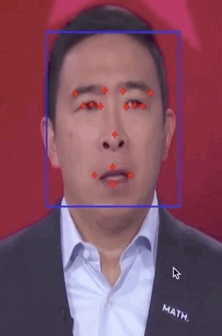

# FacialKeypoints
A project as part of [coursera]( https://www.coursera.org/projects/facial-key-point-detection) based on kaggle's 15 facial keypoint [dataset](https://www.kaggle.com/c/facial-keypoints-detection/data).

### To Run
```javascript
python main.py
```

### Example outputs:




